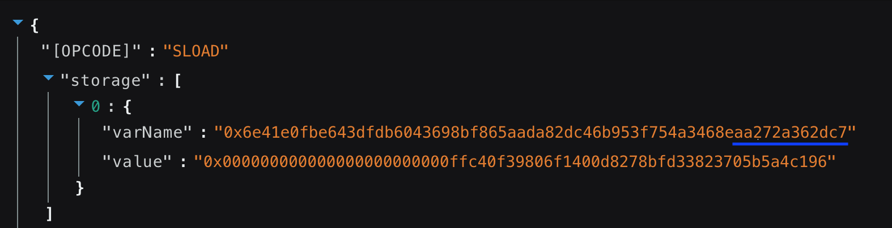
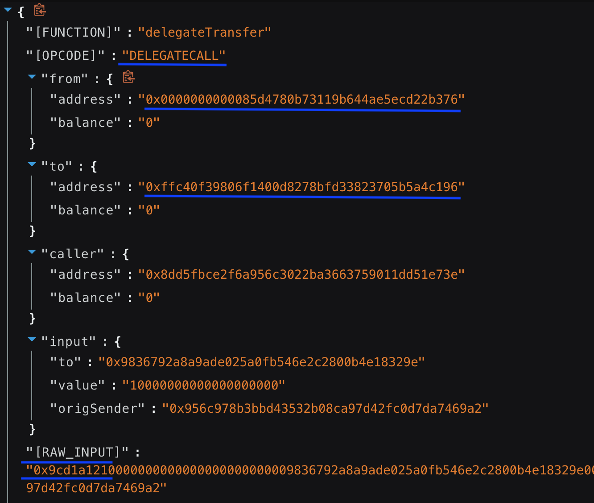
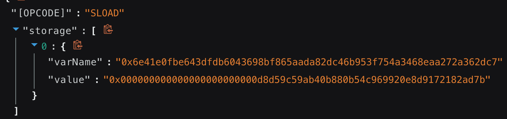
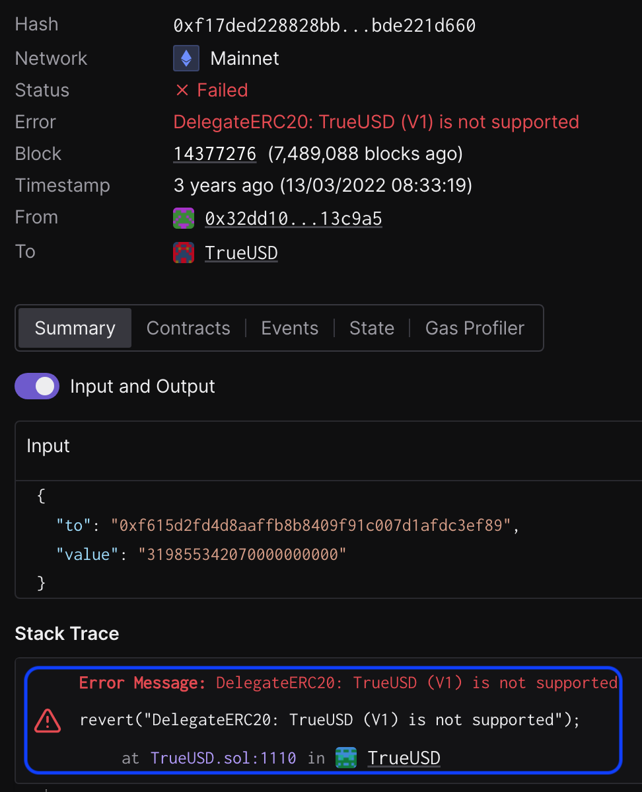

# stale-amm - Tier 2
It’s May 2021, and while searching for new trading pools, you discovered that someone made [2.8x](https://etherscan.io/tx/0x3f1b5baef6ea7f622834eabe7634bf89e3f473b62a73e357fdd04a1a5cf32ecf) by selling TUSD through one of the old Uniswap v1 pools. Let’s figure out how it happened.


- a) What is the reason for the stale price in this pool?
- b) Provide all necessary simulation data to arbitrage the pool on January 23, 2022.
- c) Could you execute the arbitrage on March 14, 2022? If not, explain why.

# Stale AMM Analysis

## a) <span style="color: #4da6ff;">What is the reason for the stale price in this pool?</span>

### Overview
Uniswap-V1 uses Constant Product AMM (Automated Market Maker) model as a price finding mechanism. The underlying formula is defined as: K = X * Y where X and Y are the reserves amounts of the tokens in the pool. The Price level of the pool is determined by the reserves.

### Pool State Analysis
The following  table summarizes the Uni-V1:TUSD Pool state:
- On the block of the last transaction before our target transaction
- One block before out target transaction:

<div style="font-size: 10px;">

| Uni-V1:TUSD*  | Last Txn Before Target | One Block Before Target | anvil/cast |
|---------|------------|------------|----------------------|
| Date | Jan-26-2021 | Apr-30-2021 | |
| Block | 11733200 | 12344573 | anvil --fork-url https://ethereum-rpc.publicnode.com --fork-block-number xxxxxxxx |
| ETH Reserve | 1368252431479061442 | 1368252431479061442 |cast balance $UNIV1_POOL |
| TUSD Reserve | 1168271595830595828836 | 1168271595830595828836 |cast call $TUSD "balanceOf(address)(uint256)" $UNIV1_POOL |
| Pool Input Price* | 189548469355043147 | 189548469355043147 |cast call $UNIV1_POOL "getTokenToEthInputPrice(uint256)(uint256)" 188436139344589717503**** |
| ETH/USD | 1,368.22 | 2,775.96 |From etherscan at txn overview|

</div>

### References
- *UNI-V1 TUSD Pool: `0x4F30E682D0541eAC91748bd38A648d759261b8f3`
- **Last Transaction Before Target Transaction: `0xdc6cd18ab577178bf1b85451d8782cc6313cbda21103486a4ae8c9bec3899e24`
- ***Target Transaction: `0x3f1b5baef6ea7f622834eabe7634bf89e3f473b62a73e357fdd04a1a5cf32ecf`
- ****Amount of TUSD sent from MEV Bot to UNI-TUSD pool in target txn: `18843613934458971750`

### Staleness Factors
As you can see from the table between the two transactions market conditions have changed, moreover pool economics has not:
1. Market ETH price almost doubled (1,368 → 2,775)
2. Pool reserves remained unchanged: this has direct impact on the pool token price calculation

In between the two transsactions there were no trades which would have aligned the Pool price with market price: the lack of liquidity caused the pool price to stale leading to the arbitrage opportunity in question.

## b) <span style="color: #4da6ff;">Provide all necessary simulation data to arbitrage the pool on January 23, 2022.</span>

On the 23 0f January 2022 we can use as reference price for eth/usd on etherscan transactions. ETH is overpriced in the pool compare market price: the strategy would be to short ETHs in the UNI-V1:TUSD pool. 

### Environment Setup
```bash
# Environment Variables
export ALICE=0xf39fd6e51aad88f6f4ce6ab8827279cfffb92266
export UNIV1_POOL=0x4F30E682D0541eAC91748bd38A648d759261b8f3
export TUSD=0x8dd5fbCe2F6a956C3022bA3663759011Dd51e73E

# Block Setup
cast find-block 1642896000 --rpc-url https://ethereum-rpc.publicnode.com
# Returns Block: 14058541

anvil --fork-url https://ethereum-rpc.publicnode.com --fork-block-number 14058541
```

A practicle aproac would be to shoitrt the same amount of eth we have received in the previus transaction, and we can check the Amount of TUSD we would receive"

```bash
cast call $UNIV1_POOL "getEthToTokenInputPrice(uint256)(uint256)" 189548469355043147
# Returns: 528198637262427634685
```
This would lead to a price of eth: 2,786.00 usd

We can proceed with execution of the transaction.

### Initial Balances

| Wallet/Pool | Balance | Command |
|-------------|----------|---------|
| Alice ETH | 10000000000000000000000 | `cast balance $ALICE` |
| Alice TUSD | 0 | `cast call $TUSD "balanceOf(address)(uint256)" $ALICE` |
| UNI-V1 ETH | 671578643201640554 | `cast balance $UNIV1_POOL` |
| UNI-V1 TUSD | 2405261049243413614839 | `cast call $TUSD "balanceOf(address)(uint256)" $UNIV1_POOL` |

### Transaction Execution
```bash
cast send $UNIV1_POOL "ethToTokenSwapInput(uint256,uint256)" \
    500000000000000000000 1700000000 \
    --value 189548469355043147 \
    --rpc-url http://127.0.0.1:8545 \
    --private-key 0xac0974bec39a17e36ba4a6b4d238ff944bacb478cbed5efcae784d7bf4f2ff80 \
    --legacy
```

### Balance Changes

| Wallet/Pool | Before | After | Difference |
|-------------|---------|--------|------------|
| Alice ETH | 10000000000000000000000 | 9999799983218288784446 | -200016781711215554 |
| Alice TUSD | 0 | 528198637262427634685 | 528198637262427634685 |
| UNI-V1 ETH | 671578643201640554 | 861127112556683701 | 189548469355043147 |
| UNI-V1 TUSD | 2405261049243413614839 | 1877062411980985980154 | -528198637262427634685 |

### Transaction Analysis

#### Gas Breakdown
Final Eth Alice balance does not match the amount of Eths that have been shorted. The reason is that we need to add the cost of gas for the transaction:

| Component | Amount |
|-----------|---------|
| ETH Shorted | 189548469355043147 |
| Gas Used | 83721 |
| Gas Price | 125038071167 |
| Total Gas Cost | 10468312356172407 |
| Total Cost | 200016781711215554 |

Please notice that Gas Used and Gas Price values are coming from the transaction receipt.

#### Pool Reserves
The change in UNI-V1 TUSD reserves level is in line with the transaction amounts and Alice balances

#### Price Analysis
- Market Price: ~2,500.00 USD/ETH
- Trade Price: ~2,786.00 USD/ETH
- Profitable arbitrage confirmed

## c) <span style="color: #4da6ff;">Could you execute the arbitrage on March 14, 2022? If not, explain why.</span>

On the 14 Of March 2022 it is not anymore feasible to execute transactions using Uniswap V1 TUSD Pool(0x4F30E682D0541eAC91748bd38A648d759261b8f3). The pool uses TUSD V1 moreover a new implementation has been introduced on Feb-22 making the TUSD V1 obsolete  becoming TrueUSD: Legacy Contract.


To see more in detail what really has changed/upgraded/introduced, I have run some analysis with the support of tenderly and anvil debug transactions.

### Contract Architecture
- TUSD Token: `0x8dd5fbCe2F6a956C3022bA3663759011Dd51e73E`
- TUSD Proxy: `0x0000000000085d4780B73119b644AE5ecd22b376`
- Storage Slot: `0x6e41e0fbe643dfdb6043698bf865aada82dc46b953f754a3468eaa272a362dc7`
- TUSD_Impl: this is the implementation contract address that is returned when we load the Storage sloat above

### Implementation Changes

#### Pre-Upgrade
- Implementation: `0xffc40f39806f1400d8278bfd33823705b5a4c196`


#### Post-Upgrade
- Implementation: `0xd8d59c59ab40b880b54c969920e8d9172182ad7b`


### A. Before Feb-22
1. TUSD_V1 forward a CALL(opcode) to the proxy contract TUSD_Proxy in order to run function delegateTransfer() (function selector 0x9cd121
2. The proxy contract receives the raw input from TUSD_V1 but it does not have the selected function therefore it uses its Fallback function to perform the DELEGATECALL (opcode)
3. The fallback function looks for the TUSD_Impl address using a specific pointer via SLOAD (opcode):
    - Storage Position: `0x6e41e0fbe643dfdb6043698bf865aada82dc46b953f754a3468eaa272a362dc7` 
    - Value: `0xffc40f39806f1400d8278bfd33823705b5a4c196`
This contract has function delegateTransfer(), and delegateTransferFrom() and raw input can be matched via EQ (opcode) function selector (ie 0x9cd1a121), as in the following example:



Delegate call and function selector:

https://dashboard.tenderly.co/tx/mainnet/0x37e8d60beefbfe371ec42e7bb02370fe1b463c04b2f17f8808274a367a04375f/debugger?trace=0.2.1 

Technically the reason why it can do that resides on the modifier in the TUSD_impl contract:

```bash
abstract contract DelegateERC20 is TrueCurrency {
    address constant DELEGATE_FROM = 0x8dd5fbCe2F6a956C3022bA3663759011Dd51e73E;
    // require msg.sender is the delegate smart contract
    modifier onlyDelegateFrom() {
        require(msg.sender == DELEGATE_FROM);
        _;
    }
}
```


### B. After Feb-22
When The Proxy contract uses the  specific pointer via SLOAD (opcode) to get the TUSD_iplm contract, a new address is returned:
    - Storage Position: `0x6e41e0fbe643dfdb6043698bf865aada82dc46b953f754a3468eaa272a362dc7` 
    - Value: `0xd8d59c59ab40b880b54c969920e8d9172182ad7b`



In the returned new contract, deployed on the 23 Feb 22,  the modifier has changed:
```bash
abstract contract DelegateERC20 is TrueCurrency {
    // require msg.sender is the delegate smart contract
    modifier onlyDelegateFrom() {
        revert("DelegateERC20: TrueUSD (V1) is not supported");
        _;
    } 
```
This can also be confirmed clearly when we check a failed transaction in thenderly:


https://dashboard.tenderly.co/tx/mainnet/0xf17ded228828bbd2d44e1a2328db8e675ee4f76ad65f3cf930fc85bde221d660


As result:
- The upgrade blocked V1 delegation pattern completely
- Users had to switch to using standard ERC20 functions instead of delegation

This made the Uniswap V1 TUSD pool unusable since it relied on the V1 delegation pattern.
